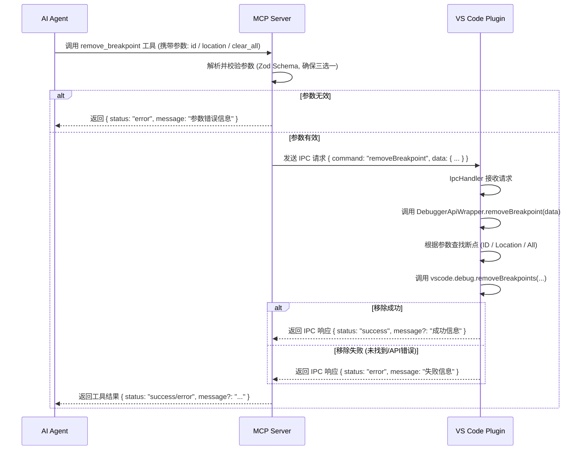

# 当前任务规划

## 任务规划

### 1. 目标

实现 `remove_breakpoint` MCP 工具，允许 AI 代理通过 MCP 服务器移除 VS Code 中的断点。支持按断点 ID、按文件位置或全部清除三种方式。

### 2. 涉及文件

*   **创建:**
    *   `mcp-server/src/toolProviders/debug/removeBreakpoint.ts`: 实现 MCP 工具的核心逻辑和参数校验。
*   **修改:**
    *   `mcp-server/src/toolProviders/debug/index.ts`: 导出 `removeBreakpoint` 工具的处理器和 Schema。
    *   `mcp-server/src/server.ts`: 注册 `remove_breakpoint` 工具。
    *   `mcp-server/src/constants.ts`: 添加 `TOOL_REMOVE_BREAKPOINT` 和 `IPC_COMMAND_REMOVE_BREAKPOINT` 常量。
    *   `mcp-server/src/pluginCommunicator.ts`: (可能需要更新类型定义以支持新请求/响应)。
    *   `src/vscode/debuggerApiWrapper.ts`: 添加 `removeBreakpoint` 方法，实现与 VS Code Debug API 的交互。
    *   `src/managers/ipcHandler.ts`: 添加处理 `IPC_COMMAND_REMOVE_BREAKPOINT` 请求的逻辑。
    *   `src/constants.ts`: 添加 `IPC_COMMAND_REMOVE_BREAKPOINT` 常量。
    *   `src/types.ts`: 更新 `PluginRequest` 和 `PluginResponse` 类型定义。

### 3. MCP 服务器端实现 (`mcp-server`)

#### 3.1. 定义工具名称和 IPC 命令常量 (`mcp-server/src/constants.ts`)

```typescript
// mcp-server/src/constants.ts
export const TOOL_REMOVE_BREAKPOINT = 'remove_breakpoint';
export const IPC_COMMAND_REMOVE_BREAKPOINT = 'removeBreakpoint';
// ... 其他常量
```

#### 3.2. 定义输入参数 Schema (`mcp-server/src/toolProviders/debug/removeBreakpoint.ts`)

使用 Zod 定义输入参数的 Schema，并包含校验逻辑（三选一）。

```typescript
// mcp-server/src/toolProviders/debug/removeBreakpoint.ts
import { z } from 'zod';

const LocationSchema = z.object({
  file_path: z.string().describe('要移除断点的源代码文件的绝对路径或相对于工作区的路径。'),
  line_number: z.number().int().positive().describe('要移除断点的行号 (基于 1 开始计数)。'),
});

export const RemoveBreakpointInputSchema = z.object({
  breakpoint_id: z.number().int().positive().optional().describe('要移除的断点的唯一 ID。'),
  location: LocationSchema.optional().describe('指定要移除断点的位置。'),
  clear_all: z.boolean().optional().describe('如果设置为 true，则尝试移除所有断点。'),
}).refine(
  (data) => {
    const providedParams = [data.breakpoint_id, data.location, data.clear_all].filter(
      (param) => param !== undefined
    );
    return providedParams.length === 1;
  },
  {
    message: '必须且只能提供 breakpoint_id、location 或 clear_all 中的一个参数。',
  }
);

export type RemoveBreakpointInput = z.infer<typeof RemoveBreakpointInputSchema>;
```

#### 3.3. 实现工具处理函数 (`mcp-server/src/toolProviders/debug/removeBreakpoint.ts`)

```typescript
// mcp-server/src/toolProviders/debug/removeBreakpoint.ts
import { ToolInputValidationException } from '@modelcontext/server';
import { pluginCommunicator } from '../../pluginCommunicator';
import { IPC_COMMAND_REMOVE_BREAKPOINT } from '../../constants';
import { RemoveBreakpointInput, RemoveBreakpointInputSchema } from './removeBreakpointSchema'; // 假设 Schema 在单独文件或同文件上方
import { z } from 'zod'; // 如果 Schema 在同文件，则不需要重复导入

export async function handleRemoveBreakpoint(params: unknown): Promise<{ status: string; message?: string }> {
  let validatedParams: RemoveBreakpointInput;
  try {
    validatedParams = RemoveBreakpointInputSchema.parse(params);
  } catch (error) {
    if (error instanceof z.ZodError) {
      // 返回 Zod 校验错误信息，特别是 refine 的错误
      throw new ToolInputValidationException(error.errors.map(e => e.message).join(', '));
    }
    // 处理其他可能的解析错误
    throw new ToolInputValidationException('输入参数格式错误');
  }

  try {
    // 通过 IPC 请求插件执行移除操作
    const response = await pluginCommunicator.sendRequest({
      command: IPC_COMMAND_REMOVE_BREAKPOINT,
      data: validatedParams, // 发送校验后的参数
    });

    if (response.status === 'success') {
      return { status: 'success', message: response.message || '断点移除成功。' };
    } else {
      return { status: 'error', message: response.message || '移除断点时发生未知错误。' };
    }
  } catch (error: any) {
    console.error('Error communicating with plugin for removeBreakpoint:', error);
    return { status: 'error', message: `与插件通信失败: ${error.message || '未知错误'}` };
  }
}
```

#### 3.4. 导出工具 (`mcp-server/src/toolProviders/debug/index.ts`)

```typescript
// mcp-server/src/toolProviders/debug/index.ts
export * from './getConfigurations';
export * from './setBreakpoint';
export * from './getBreakpoints';
export * from './removeBreakpoint'; // 新增导出
```

#### 3.5. 注册工具 (`mcp-server/src/server.ts`)

```typescript
// mcp-server/src/server.ts
import { McpServer } from '@modelcontext/server';
import { TOOL_GET_CONFIGURATIONS, TOOL_SET_BREAKPOINT, TOOL_GET_BREAKPOINTS, TOOL_REMOVE_BREAKPOINT } from './constants'; // 导入新常量
import {
  handleGetDebuggerConfigurations, GetDebuggerConfigurationsInputSchema,
  handleSetBreakpoint, SetBreakpointInputSchema,
  handleGetBreakpoints, GetBreakpointsInputSchema,
  handleRemoveBreakpoint, RemoveBreakpointInputSchema // 导入新处理器和 Schema
} from './toolProviders/debug';

// ... 其他导入和代码

const server = new McpServer({ /* ... options ... */ });

// ... 其他工具注册

server.tool(
  TOOL_REMOVE_BREAKPOINT,
  '移除一个或多个 VS Code 调试断点。',
  RemoveBreakpointInputSchema, // 使用 Zod Schema
  handleRemoveBreakpoint
);

// ... 启动服务器等
```

### 4. VS Code 插件端实现 (`src`)

#### 4.1. 定义 IPC 命令常量 (`src/constants.ts`)

```typescript
// src/constants.ts
export const IPC_COMMAND_REMOVE_BREAKPOINT = 'removeBreakpoint';
// ... 其他常量
```

#### 4.2. 更新 IPC 类型定义 (`src/types.ts`)

需要扩展 `PluginRequestData` 和 `PluginResponseData` 来包含 `removeBreakpoint` 的参数和结果。

```typescript
// src/types.ts
import * as vscode from 'vscode';

// ... 其他类型定义

// 定义 removeBreakpoint 的参数类型 (与 MCP Server Schema 对应，但可能不需要 Zod)
interface RemoveBreakpointParams {
  breakpoint_id?: number;
  location?: {
    file_path: string;
    line_number: number;
  };
  clear_all?: boolean;
}

// 扩展 PluginRequestData
export type PluginRequestData =
  | { command: typeof IPC_COMMAND_GET_CONFIGURATIONS; data?: any }
  | { command: typeof IPC_COMMAND_SET_BREAKPOINT; data: SetBreakpointParams } // 假设 SetBreakpointParams 已定义
  | { command: typeof IPC_COMMAND_GET_BREAKPOINTS; data?: any }
  | { command: typeof IPC_COMMAND_REMOVE_BREAKPOINT; data: RemoveBreakpointParams } // 新增
  | { command: 'someOtherCommand'; data: any }; // 其他命令

// 扩展 PluginResponseData
export type PluginResponseData =
  | { status: 'success'; configurations?: vscode.DebugConfiguration[]; message?: string } // for getConfigurations
  | { status: 'success'; breakpoint?: vscode.Breakpoint; message?: string } // for setBreakpoint
  | { status: 'success'; breakpoints?: vscode.Breakpoint[]; timestamp?: string; message?: string } // for getBreakpoints
  | { status: 'success'; message?: string } // for removeBreakpoint (成功)
  | { status: 'error'; message: string }; // 通用错误响应
```

#### 4.3. 实现 `removeBreakpoint` 方法 (`src/vscode/debuggerApiWrapper.ts`)

```typescript
// src/vscode/debuggerApiWrapper.ts
import * as vscode from 'vscode';
import { getWorkspaceUri } from '../utils/workspace'; // 假设有此工具函数获取工作区 URI
import { resolveFilePath } from '../utils/pathUtils'; // 假设有此工具函数解析路径

// ... 其他导入和代码

export class DebuggerApiWrapper {
  // ... 其他方法 (addBreakpoint, getBreakpoints)

  async removeBreakpoint(params: RemoveBreakpointParams): Promise<{ status: 'success' | 'error'; message?: string }> {
    const allBreakpoints = vscode.debug.breakpoints;

    try {
      if (params.clear_all) {
        if (allBreakpoints.length > 0) {
          await vscode.debug.removeBreakpoints(allBreakpoints);
          return { status: 'success', message: '已清除所有断点。' };
        } else {
          return { status: 'success', message: '没有活动的断点可清除。' };
        }
      } else if (params.breakpoint_id !== undefined) {
        const breakpointToRemove = allBreakpoints.find(bp => bp.id === String(params.breakpoint_id)); // VS Code Breakpoint ID 是 string
        if (breakpointToRemove) {
          await vscode.debug.removeBreakpoints([breakpointToRemove]);
          return { status: 'success', message: `已移除 ID 为 ${params.breakpoint_id} 的断点。` };
        } else {
          return { status: 'error', message: `未找到 ID 为 ${params.breakpoint_id} 的断点。` };
        }
      } else if (params.location) {
        const targetUri = await resolveFilePath(params.location.file_path); // 解析路径为 URI
        if (!targetUri) {
            return { status: 'error', message: `无法解析文件路径: ${params.location.file_path}` };
        }
        const targetLine = params.location.line_number; // VS Code API 使用 0-based line number? 需要确认, 文档是 1-based, 但 API 可能是 0-based. 假设 API 内部处理或需要转换

        const breakpointsToRemove = allBreakpoints.filter(bp => {
          if (bp.location && bp.location.uri.toString() === targetUri.toString()) {
            // VS Code Location line is 0-based, input is 1-based
            return bp.location.range.start.line === targetLine - 1;
          }
          return false;
        });

        if (breakpointsToRemove.length > 0) {
          await vscode.debug.removeBreakpoints(breakpointsToRemove);
          return { status: 'success', message: `已移除位于 ${params.location.file_path}:${targetLine} 的 ${breakpointsToRemove.length} 个断点。` };
        } else {
          return { status: 'error', message: `在 ${params.location.file_path}:${targetLine} 未找到断点。` };
        }
      } else {
        // 参数校验已在 MCP 服务器端完成，理论上不会到这里
        return { status: 'error', message: '无效的移除断点参数。' };
      }
    } catch (error: any) {
      console.error('Error removing breakpoints:', error);
      return { status: 'error', message: `移除断点时发生错误: ${error.message || '未知 VS Code API 错误'}` };
    }
  }
}
```
*   **注意:** `resolveFilePath` 的实现需要确保能正确处理绝对路径和相对路径，并返回 `vscode.Uri`。同时需要确认 `vscode.debug.removeBreakpoints` 和 `vscode.Location` 中行号是 0-based 还是 1-based，并进行相应调整。`ProjectBrief.md` 定义行号为 1-based，VS Code API 通常是 0-based，因此 `targetLine - 1` 是必要的。

#### 4.4. 处理 IPC 请求 (`src/managers/ipcHandler.ts`)

```typescript
// src/managers/ipcHandler.ts
import { DebuggerApiWrapper } from '../vscode/debuggerApiWrapper';
import { PluginRequestData, PluginResponseData } from '../types';
import {
  IPC_COMMAND_GET_CONFIGURATIONS,
  IPC_COMMAND_SET_BREAKPOINT,
  IPC_COMMAND_GET_BREAKPOINTS,
  IPC_COMMAND_REMOVE_BREAKPOINT // 导入新常量
} from '../constants';

export class IpcHandler {
  private debuggerApiWrapper: DebuggerApiWrapper;

  constructor() {
    this.debuggerApiWrapper = new DebuggerApiWrapper();
  }

  async handleRequest(request: PluginRequestData): Promise<PluginResponseData> {
    try {
      switch (request.command) {
        case IPC_COMMAND_GET_CONFIGURATIONS:
          // ... (处理 getConfigurations)
          break;
        case IPC_COMMAND_SET_BREAKPOINT:
          // ... (处理 setBreakpoint)
          break;
        case IPC_COMMAND_GET_BREAKPOINTS:
          // ... (处理 getBreakpoints)
          break;
        case IPC_COMMAND_REMOVE_BREAKPOINT: // 新增 case
          if (request.data) {
            return await this.debuggerApiWrapper.removeBreakpoint(request.data);
          } else {
            return { status: 'error', message: '移除断点请求缺少参数。' };
          }
        default:
          console.warn(`Received unknown IPC command: ${request.command}`);
          return { status: 'error', message: `不支持的命令: ${request.command}` };
      }
    } catch (error: any) {
      console.error(`Error handling IPC command ${request.command}:`, error);
      return { status: 'error', message: `处理命令 ${request.command} 时发生内部错误: ${error.message}` };
    }
     // Add a default return statement or handle all cases explicitly
     return { status: 'error', message: `未能处理命令: ${request.command}` };
  }
}
```

### 5. IPC 通信流程



### 6. 错误处理

*   **MCP 服务器:**
    *   捕获 Zod 校验错误，返回 `ToolInputValidationException`。
    *   捕获与插件的 IPC 通信错误。
    *   透传插件返回的错误信息。
*   **VS Code 插件:**
    *   处理 `vscode.debug.breakpoints` 访问错误。
    *   处理 `vscode.debug.removeBreakpoints` API 调用可能抛出的异常。
    *   处理文件路径解析失败 (`resolveFilePath`)。
    *   处理未找到指定断点的情况。
    *   将具体的错误信息包装在 `PluginResponseData` 中返回。

### 7. 后续步骤

1.  编码者根据此规划实现代码。
2.  进行单元测试和集成测试，确保三种移除方式和错误处理都按预期工作。
3.  更新相关文档（如果需要）。

## 任务上下文

### 需求描述 (来自 MemoryBank/ProjectBrief.md 164-179)
```
**4.3 `remove_breakpoint` (移除断点)**

*   **目的:** 移除一个或多个之前设置的断点。
*   **类型:** 同步工具。
*   **输入参数:**
    *   `breakpoint_id` (可选,number): 要移除的断点的唯一 ID (通过 `set_breakpoint` 或 `get_breakpoints` 获取)。这是最精确的方式。
    *   `location` (可选,object): 一个包含 `file_path` (string) 和 `line_number` (number) 的对象，用于指定要移除断点的位置。如果该位置有多个断点（例如，同一行的不同列），可能移除所有匹配的断点。
    *   `clear_all` (可选,boolean): 如果设置为 `true`，则尝试移除当前调试会话中所有已设置的断点。
*   **返回值:**
    *   **成功:**
        *   `status`: `"success"`
        *   *(可选)* `message`: (string) 可能包含移除操作的附加信息，例如 "已移除 ID 为 3 的断点" 或 "已清除所有断点"。
    *   **失败:**
        *   `status`: `"error"`
        *   `message`: 描述移除断点失败原因的字符串 (string)，例如 `"未找到 ID 为 99 的断点"`, `"指定位置没有断点"`。
如果没接受到参数，则返回错误信息,告知用户需要提供参数,三选一即可。若提供多个参数也返回错误信息,告知用户只能提供一个参数。就不做输入时的强行验证了(因为做起来有点麻烦,就直接接受全部传入参数但后续返回错误信息吧)
```

### 项目代码上下文

*   **断点管理核心 (VS Code 插件端):**
    *   `src/vscode/debuggerApiWrapper.ts`: 封装了与 VS Code Debug API 交互的逻辑。`addBreakpoint` 和 `getBreakpoints` 的实现在此文件中，`remove_breakpoint` 的实现也将在此处。
        *   使用 `vscode.debug.breakpoints` 获取当前所有断点。
        *   使用 `vscode.debug.removeBreakpoints(breakpoints: ReadonlyArray<vscode.Breakpoint>)` API 移除断点。
    *   `src/types.ts`: 定义了插件与 MCP 服务器之间 IPC 通信的共享类型 (`PluginRequest`, `PluginResponse`)。
    *   `src/constants.ts`: 定义了插件端使用的常量，包括 IPC 命令名称。需要新增 `IPC_COMMAND_REMOVE_BREAKPOINT`。
    *   `src/managers/ipcHandler.ts`: 插件端处理来自 MCP 服务器的 IPC 请求，并将调试相关请求委托给 `DebuggerApiWrapper`。需要在此处添加对 `IPC_COMMAND_REMOVE_BREAKPOINT` 的处理。

*   **MCP 服务器端工具处理:**
    *   `mcp-server/src/toolProviders/debug/setBreakpoint.ts`: 提供了 MCP 工具处理函数的基本结构和参数校验示例 (`zod`)。
    *   `mcp-server/src/toolProviders/debug/getBreakpoints.ts`: 提供了 MCP 工具处理函数的基本结构和与插件进行 IPC 通信的示例。
    *   `mcp-server/src/toolProviders/debug/index.ts`: 导出调试工具组的实现。需要在此处导出 `handleRemoveBreakpoint` 函数和其 Schema。
    *   `mcp-server/src/server.ts`: MCP 服务器的入口文件，负责工具的注册。需要在此处使用 `server.tool()` 注册 `remove_breakpoint` 工具。
    *   `mcp-server/src/pluginCommunicator.ts`: MCP 服务器端用于向插件发送 IPC 请求。
    *   `mcp-server/src/constants.ts`: 定义了 MCP 服务器端使用的常量，包括 MCP 工具名称 (`TOOL_REMOVE_BREAKPOINT`) 和 IPC Command 名称。需要新增 `IPC_COMMAND_REMOVE_BREAKPOINT`。
    *   `mcp-server/src/toolHandler.ts`: 未找到此文件，工具注册逻辑在 `mcp-server/src/server.ts` 中实现。
    *   `mcp-server/src/types.ts`: 未找到此文件，相关类型定义可能在 `src/types.ts` 或其他文件中。

## 审查结果

对 `remove_breakpoint` 工具的代码实现进行了审查，结果如下：

**1. 符合规划:**
   - **符合:** 代码实现遵循了 `MemoryBank/CurrentTask.md` 中 `## 任务规划` 部分的方案。涉及的文件修改、常量定义、工具导出与注册、插件端实现、IPC 流程均与规划一致。

**2. 功能完整:**
   - **是:** `src/vscode/debuggerApiWrapper.ts` 中的 `removeBreakpoint` 方法完整实现了按断点 ID (`breakpoint_id`)、按文件位置 (`location`) 和全部清除 (`clear_all`) 三种断点移除方式。

**3. 参数校验:**
   - **逻辑正确:** 三选一的参数校验逻辑已在 MCP 服务器端 (`mcp-server/src/toolProviders/debug/removeBreakpoint.ts`) 通过手动检查实现，确保了用户必须且只能提供一种移除方式，符合需求文档和用户反馈要求。

**4. IPC 通信:**
   - **正确:** MCP 服务器与插件间的 IPC 通信流程正确无误。
     - 服务器端使用 `sendRequestToPlugin` 发送 `IPC_COMMAND_REMOVE_BREAKPOINT` 请求。
     - 插件端 `IpcHandler` 正确接收请求，并委托给 `DebuggerApiWrapper` 处理。
     - 插件端使用 `processManager.send` 将结果返回给服务器。
     - `src/types.ts` 中定义的 `RemoveBreakpointParams`, `PluginRequestData`, `PluginResponseData` 类型在两端正确使用，类型匹配。

**5. VS Code API 使用:**
   - **正确:** `src/vscode/debuggerApiWrapper.ts` 中对 VS Code Debug API 的使用是正确的。
     - 正确使用 `vscode.debug.breakpoints` 获取断点列表。
     - 正确使用 `vscode.debug.removeBreakpoints()` 移除断点。
     - 正确处理了 VS Code Breakpoint ID 为 `string` 类型。
     - 正确处理了行号从 1-based (输入) 到 0-based (API) 的转换。
     - 使用 `vscode.Uri.file()` 处理文件路径，并包含了相应的错误处理。

**6. 错误处理:**
   - **覆盖全面:** 代码覆盖了规划中提到的主要错误场景。
     - **MCP 服务器:** 处理了参数校验失败（Zod 及手动）、IPC 通信错误、插件返回错误。
     - **插件端:** 处理了路径无效、未找到断点、VS Code API 调用异常等情况。
   - **处理合理:** 错误发生时，均返回了包含 `status: "error"` 和描述性 `message` 的响应，符合预期。

**7. 代码质量:**
   - **尚可:** 代码风格基本一致，包含必要的日志输出，可读性尚可。
   - **优化建议:**
     - **返回类型 `content` 字段:** MCP 服务器端 `handleRemoveBreakpoint` 的返回类型 `RemoveBreakpointResult` 包含了 `content: { type: "text", text: string }[]` 字段，这在 `remove_breakpoint` 的规划中并未提及。请确认这是否是项目 Debug 工具组统一的返回规范。如果是，则保持现状；如果不是，可以简化返回类型为 `{ status: string; message?: string }`，与规划一致。
     - **`ipcHandler.ts` 错误处理:** 在 `src/managers/ipcHandler.ts` 中处理 `removeBreakpoint` 返回结果时，错误情况可以直接使用 `removeResult.message`，无需添加默认的 '移除断点失败'。 (当前代码: `message: removeResult.message || '移除断点失败'`)

**总结:**

`remove_breakpoint` 工具的核心功能已正确实现，符合规划要求。建议确认返回类型中 `content` 字段的必要性。代码质量良好，错误处理充分。

**后续行动:**

- **建议:** 编码者可根据优化建议调整代码（主要是确认 `content` 字段）。
- **确认:** 代码整体功能已实现，审查通过。

## Bug 分析与解决方案 (针对 remove_breakpoint 按 location 移除失败)

**1. 问题现象:**

用户使用 `remove_breakpoint` 工具并提供 `location` 参数（包含相对路径 `file_path` 和 `line_number`）尝试移除断点时，即使断点实际存在于指定位置，工具仍返回 "未找到断点" 的错误。

**错误信息示例:** "在 CodeTools/SVNTool/svn_diff_report.py:271 未找到断点。"

**2. 根本原因分析:**

经过对 `src/vscode/debuggerApiWrapper.ts` 中 `removeBreakpoint` 方法的分析，并结合读取 `src/utils/pathUtils.ts` 失败（确认规划中的 `resolveFilePath` 不存在或未按预期使用）的情况，确定根本原因为：

*   **相对路径处理不当:**
    *   该方法直接将用户传入的 `params.location.file_path`（可能是相对路径）传递给了 `vscode.Uri.file()` (代码第 209 行)。
    *   `vscode.Uri.file()` 期望接收绝对路径。当传入相对路径时，它无法正确地将其解析为相对于当前 VS Code 工作区的绝对路径 URI。
    *   这导致生成的 `targetUri` 与 `vscode.debug.breakpoints` 中存储的、基于工作区根目录的、规范化的绝对路径 URI 不匹配。

*   **Uri 比较失败:**
    *   虽然代码使用 `bp.location.uri.toString() === targetUri.toString()` (代码第 219 行) 进行比较，但由于 `targetUri` 本身是基于错误的路径创建的，比较必然失败。
    *   这导致 `breakpointsToRemove` 数组为空，最终返回 "未找到断点" 的错误。

*   **行号比较正确:** 行号从 1-based 到 0-based 的转换和比较逻辑是正确的，不是 Bug 的原因。

**3. 解决方案:**

修改 `src/vscode/debuggerApiWrapper.ts` 中的 `removeBreakpoint` 方法，在通过 `location` 参数查找断点时，**必须先将传入的相对文件路径转换为绝对路径**，然后再创建 `vscode.Uri` 对象进行比较。

**具体代码修改建议:**

```typescript
// src/vscode/debuggerApiWrapper.ts

// 1. 引入 Node.js path 模块
import * as path from 'path';

// ... 在 removeBreakpoint 方法内，处理 params.location 的分支 ...
            } else if (params.location) {
                const relativeFilePath = params.location.file_path; // 接收到的可能是相对路径
                const targetLine = params.location.line_number; // 1-based
                const zeroBasedTargetLine = targetLine - 1;

                console.log(`[DebuggerApiWrapper] Attempting to remove breakpoint by location: ${relativeFilePath}:${targetLine}`);

                // --- 解决方案核心：将相对路径转换为绝对路径 ---
                let absoluteFilePath: string;
                if (path.isAbsolute(relativeFilePath)) {
                    // 如果已经是绝对路径，直接使用
                    absoluteFilePath = relativeFilePath;
                    console.log(`[DebuggerApiWrapper] Path "${relativeFilePath}" is already absolute.`);
                } else {
                    // 如果是相对路径，基于工作区根目录解析
                    const workspaceFolders = vscode.workspace.workspaceFolders;
                    if (!workspaceFolders || workspaceFolders.length === 0) {
                        // 无法确定工作区，无法解析相对路径
                        return { status: IPC_STATUS_ERROR, message: '无法确定工作区根目录以解析相对路径。' };
                    }
                    // 通常使用第一个工作区文件夹作为根目录
                    const workspaceRootUri = workspaceFolders[0].uri;
                    // 使用 path.resolve 结合 workspaceFolder 的 fsPath 来构造绝对路径
                    absoluteFilePath = path.resolve(workspaceRootUri.fsPath, relativeFilePath);
                    console.log(`[DebuggerApiWrapper] Resolved relative path "${relativeFilePath}" to absolute path "${absoluteFilePath}" based on workspace root "${workspaceRootUri.fsPath}"`);
                }
                // --- 结束解决方案核心 ---


                let targetUri: vscode.Uri;
                try {
                    // 2. 使用转换后的绝对路径创建 Uri
                    targetUri = vscode.Uri.file(absoluteFilePath);
                } catch (pathError: any) {
                     console.error(`[DebuggerApiWrapper] Error creating Uri from absolute path "${absoluteFilePath}":`, pathError);
                     // 报告错误时使用绝对路径
                     return { status: IPC_STATUS_ERROR, message: `文件路径格式无效: ${absoluteFilePath} (${pathError.message})` };
                }

                console.log(`[DebuggerApiWrapper] Target URI for comparison: ${targetUri.toString()}, Target 0-based line: ${zeroBasedTargetLine}`);

                const breakpointsToRemove = allBreakpoints.filter(bp => {
                    if (bp instanceof vscode.SourceBreakpoint) {
                        // 3. (推荐) 使用 fsPath 进行比较，更健壮
                        const matchesPath = bp.location.uri.fsPath === targetUri.fsPath;
                        const matchesLine = bp.location.range.start.line === zeroBasedTargetLine;
                        // 可选：添加详细日志进行调试
                        // console.log(`[DebuggerApiWrapper] Comparing BP URI: ${bp.location.uri.fsPath} (Type: ${typeof bp.location.uri.fsPath}) with Target URI: ${targetUri.fsPath} (Type: ${typeof targetUri.fsPath}) => ${matchesPath}`);
                        // console.log(`[DebuggerApiWrapper] Comparing BP Line: ${bp.location.range.start.line} with Target Line: ${zeroBasedTargetLine} => ${matchesLine}`);
                        return matchesPath && matchesLine;
                    }
                    return false;
                });

                if (breakpointsToRemove.length > 0) {
                    console.log(`[DebuggerApiWrapper] Found ${breakpointsToRemove.length} breakpoints at location to remove.`);
                    await vscode.debug.removeBreakpoints(breakpointsToRemove);
                    // 4. 在返回消息中使用绝对路径
                    return { status: IPC_STATUS_SUCCESS, message: `已移除位于 ${absoluteFilePath}:${targetLine} 的 ${breakpointsToRemove.length} 个断点。` };
                } else {
                    console.log(`[DebuggerApiWrapper] No breakpoints found at location ${absoluteFilePath}:${targetLine}.`);
                    // 4. 在返回消息中使用绝对路径
                    return { status: IPC_STATUS_ERROR, message: `在 ${absoluteFilePath}:${targetLine} 未找到断点。` };
                }
            }
// ...

```

**4. 预期效果:**

应用此解决方案后，当用户通过 `location` 参数（包含相对路径）调用 `remove_breakpoint` 时，插件端将能正确解析文件路径，找到匹配的断点并成功移除。

**5. 移交编码者:**

请编码者根据上述分析和代码修改建议，更新 `src/vscode/debuggerApiWrapper.ts` 文件。
