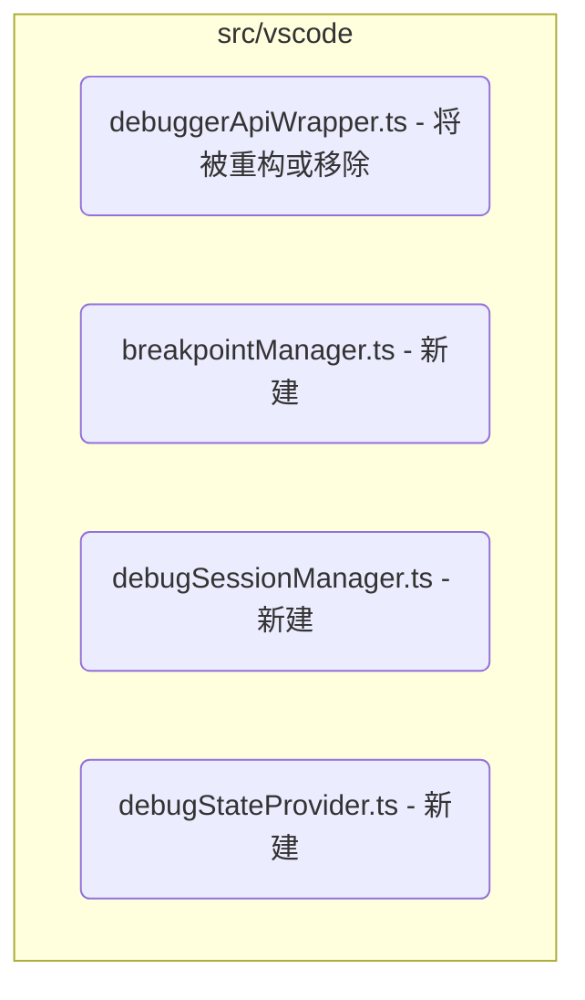

# 当前任务规划

## 任务目标
重构 `src/vscode/debuggerApiWrapper.ts` 文件，将其按照功能职责拆分成更小、更易于维护的模块，优化项目结构，提高代码的可读性和可扩展性。

## 任务上下文
### 待重构文件概述
- `src/vscode/debuggerApiWrapper.ts`: 封装了 VS Code Debug API 的调用，处理断点的设置、获取、移除以及调试会话的启动和状态跟踪。该文件目前包含了所有与 VS Code 调试功能直接交互的逻辑，功能较为集中。

### 建议拆分模块
根据功能职责，`src/vscode/debuggerApiWrapper.ts` 可以考虑拆分为以下模块：
1.  **BreakpointManager**: 负责断点的增删改查 (`addBreakpoint`, `getBreakpoints`, `removeBreakpoint`)。
2.  **DebugSessionManager**: 负责调试会话的生命周期管理，包括启动会话、等待停止事件、处理会话结束等 (`startDebuggingAndWait`, `PendingRequest`, `cleanupRequest`, Debug Adapter Tracker 相关逻辑，Session 生命周期监听器)。
3.  **DebugStateProvider**: 负责在调试停止时获取当前的调试状态信息，如调用栈和变量 (`buildStopEventData`)。

### 相关代码片段或关键函数签名
- `src/vscode/debuggerApiWrapper.ts`:
    - `class DebuggerApiWrapper { ... }` (Lines 27-587)
    - `public async addBreakpoint(payload: SetBreakpointParams): Promise<{ breakpoint: any } | { error: { message: string } }>` (Lines 48-165)
    - `public getBreakpoints(): any[]` (Lines 168-200)
    - `async removeBreakpoint(params: RemoveBreakpointParams): Promise<{ status: typeof IPC_STATUS_SUCCESS | typeof IPC_STATUS_ERROR; message?: string }>` (Lines 203-306)
    - `public async startDebuggingAndWait(configurationName: string, noDebug: boolean): Promise<StartDebuggingResponsePayload>` (Lines 309-514)
    - `private async buildStopEventData(session: vscode.DebugSession, stopBody: any): Promise<StopEventData>` (Lines 518-586)
    - `interface PendingRequest { ... }` (Lines 13-22)

### 与其他文件的依赖关系
- **`src/extension.ts`**: 实例化 `DebuggerApiWrapper` 并将其作为依赖注入到 `McpServerManager` 中。
- **`src/mcpServerManager.ts`**: 在构造函数中接收 `DebuggerApiWrapper` 实例，并将其传递给 `IpcHandler`。
- **`src/managers/ipcHandler.ts`**: 持有 `DebuggerApiWrapper` 实例，并根据接收到的 MCP 请求调用其相应的方法。
- **`src/types.ts`**: 定义了 `DebuggerApiWrapper` 中函数使用的参数和返回值的类型接口，如 `SetBreakpointParams`, `RemoveBreakpointParams`, `StartDebuggingRequestPayload`, `StartDebuggingResponsePayload`, `StopEventData`, `VariableInfo` 等。
- **`mcp-server/src/toolProviders/debug/`**: 服务器端的调试工具实现（如 `setBreakpoint.ts`, `getBreakpoints.ts`, `getConfigurations.ts` 等）通过 IPC 调用插件端 `IpcHandler`，最终由 `DebuggerApiWrapper` 执行实际的 VS Code Debug API 操作。

### 引用的相关文档章节或内容
- **`Docs/Doc_Project_Structure.md`**:
    - Section 2: 描述 `src/vscode/` 目录的作用以及 `mcp-server/src/toolProviders/debug/` 目录结构。
    - Section 3: 描述 `src/extension.ts`, `src/mcpServerManager.ts`, `src/managers/IpcHandler.ts`, `src/vscode/DebuggerApiWrapper.ts` 的职责。
- **`Docs/Doc_Debug_Tools.md`**:
    - Section 4: 详细说明了各个调试工具（对应 `DebuggerApiWrapper` 中的方法）的规格、参数和返回值。
    - Section 5: 描述了 `StopEventData` 的结构，这是 `buildStopEventData` 函数需要构建的数据格式。
- **`Docs/Doc_MCP_README.md`**: 提供了 MCP 协议、工具、资源和传输方式（HTTP with SSE）的背景信息，有助于理解 `debuggerApiWrapper.ts` 在整个系统中的作用。

## 任务规划
### 1. 创建新的文件和目录结构
在 `src/vscode/` 目录下创建以下文件，用于存放拆分后的模块：
- `src/vscode/breakpointManager.ts`
- `src/vscode/debugSessionManager.ts`
- `src/vscode/debugStateProvider.ts`



### 2. 迁移代码逻辑
#### 2.1. `breakpointManager.ts`
- **职责**: 管理断点的增、删、查。
- **迁移内容**:
    - 从 `debuggerApiWrapper.ts` 中剪切 `addBreakpoint`, `getBreakpoints`, `removeBreakpoint` 方法及其相关的私有辅助函数、成员变量（如 `breakpoints` 集合）。
    - 将这些代码粘贴到 `breakpointManager.ts` 中，并封装在一个新的 `BreakpointManager` 类中。
    - 确保所有依赖的 `vscode` API 和类型定义 (`SetBreakpointParams`, `RemoveBreakpointParams` 等从 `src/types.ts` 导入) 都已正确导入。
    - 导出 `BreakpointManager` 类。
- **示例代码结构**:
  ```typescript
  // src/vscode/breakpointManager.ts
  import * as vscode from 'vscode';
  import { SetBreakpointParams, RemoveBreakpointParams } from '../types'; // 确认路径
  import { IPC_STATUS_SUCCESS, IPC_STATUS_ERROR } from '../constants'; // 确认路径

  export class BreakpointManager {
      private breakpoints: Map<string, vscode.Breakpoint[]> = new Map(); // 示例，具体实现根据原代码调整

      constructor() {
          // 初始化逻辑，例如监听断点变化事件
          this.initializeBreakpointListener();
      }

      private initializeBreakpointListener(): void {
          vscode.debug.onDidChangeBreakpoints(e => {
              // 更新内部断点状态的逻辑...
              console.log('Breakpoints changed:', e);
              // 可能需要更新 this.breakpoints
          });
      }

      public async addBreakpoint(payload: SetBreakpointParams): Promise<{ breakpoint: vscode.Breakpoint } | { error: { message: string } }> {
          // 原 addBreakpoint 的逻辑...
          // 注意处理文件路径转换（相对路径 -> 绝对路径）
          // ...
          try {
              const uri = vscode.Uri.file(payload.file_path); // 假设 file_path 是绝对路径
              const position = new vscode.Position(payload.line_number - 1, payload.column_number ? payload.column_number - 1 : 0);
              const location = new vscode.Location(uri, position);

              const newBreakpoint = new vscode.SourceBreakpoint(location, true /* enabled */, payload.condition, payload.hit_condition, payload.log_message);

              // 检查是否已存在相同断点 (根据位置、条件等)
              const existingBreakpoints = vscode.debug.breakpoints;
              const duplicate = existingBreakpoints.find(bp =>
                  bp instanceof vscode.SourceBreakpoint &&
                  bp.location.uri.fsPath === uri.fsPath &&
                  bp.location.range.start.line === position.line &&
                  bp.location.range.start.character === position.character &&
                  bp.condition === payload.condition &&
                  bp.hitCondition === payload.hit_condition &&
                  bp.logMessage === payload.log_message
              );

              if (duplicate) {
                  console.log(`Breakpoint already exists at ${payload.file_path}:${payload.line_number}, returning existing.`);
                  // 注意：VS Code API 不直接返回 ID，需要从 getBreakpoints 获取或自行管理映射
                  // 暂时返回找到的重复断点，后续可能需要调整返回结构以符合 MCP 规范中的 ID
                  return { breakpoint: this.mapVsCodeBreakpointToMcp(duplicate) };
              }

              vscode.debug.addBreakpoints([newBreakpoint]);
              console.log(`Added breakpoint at ${payload.file_path}:${payload.line_number}`);

              // 等待 VS Code 确认断点 (可能需要异步处理或监听事件)
              // 暂时返回添加的断点信息，ID 可能需要后续获取
              // 注意：直接返回 newBreakpoint 可能没有 ID，需要查找添加后的实际断点
              // 查找刚添加的断点可能需要一点时间，或者通过 onDidChangeBreakpoints 事件确认
              // 简化处理：假设添加成功，返回基本信息，ID 问题待后续解决
              const addedBp = await this.findAddedBreakpoint(newBreakpoint); // 需要实现 findAddedBreakpoint
              if (addedBp) {
                  return { breakpoint: this.mapVsCodeBreakpointToMcp(addedBp) };
              } else {
                  // 如果无法立即找到，可能需要返回一个表示“已请求”的状态
                  // 或者返回一个包含基本信息的对象，ID 稍后更新
                  return { breakpoint: this.mapVsCodeBreakpointToMcp(newBreakpoint, true) }; // 标记为未验证
              }

          } catch (error: any) {
              console.error('Error adding breakpoint:', error);
              return { error: { message: error.message || 'Failed to add breakpoint' } };
          }
      }

      public getBreakpoints(): any[] { // 返回类型应与 MCP 规范一致
          // 原 getBreakpoints 的逻辑...
          return vscode.debug.breakpoints.map(bp => this.mapVsCodeBreakpointToMcp(bp));
      }

      public async removeBreakpoint(params: RemoveBreakpointParams): Promise<{ status: typeof IPC_STATUS_SUCCESS | typeof IPC_STATUS_ERROR; message?: string }> {
          // 原 removeBreakpoint 的逻辑...
          // ...
          try {
              let breakpointsToRemove: vscode.Breakpoint[] = [];
              if (params.breakpoint_id) {
                  // VS Code API 不直接通过 ID 删除，需要找到对应的 Breakpoint 对象
                  // 需要维护一个 ID -> Breakpoint 的映射，或者遍历查找
                  const bp = this.findBreakpointById(params.breakpoint_id); // 需要实现 findBreakpointById
                  if (bp) {
                      breakpointsToRemove.push(bp);
                  } else {
                      return { status: IPC_STATUS_ERROR, message: `Breakpoint with ID ${params.breakpoint_id} not found.` };
                  }
              } else if (params.location) {
                  const uri = vscode.Uri.file(params.location.file_path); // 假设是绝对路径
                  const line = params.location.line_number - 1;
                  breakpointsToRemove = vscode.debug.breakpoints.filter(bp =>
                      bp instanceof vscode.SourceBreakpoint &&
                      bp.location.uri.fsPath === uri.fsPath &&
                      bp.location.range.start.line === line
                  );
                  if (breakpointsToRemove.length === 0) {
                      return { status: IPC_STATUS_ERROR, message: `No breakpoint found at ${params.location.file_path}:${params.location.line_number}.` };
                  }
              } else if (params.clear_all) {
                  breakpointsToRemove = [...vscode.debug.breakpoints];
              } else {
                  return { status: IPC_STATUS_ERROR, message: 'Invalid parameters. Provide breakpoint_id, location, or clear_all.' };
              }

              if (breakpointsToRemove.length > 0) {
                  vscode.debug.removeBreakpoints(breakpointsToRemove);
                  console.log(`Removed ${breakpointsToRemove.length} breakpoint(s).`);
              }
              return { status: IPC_STATUS_SUCCESS, message: `Removed ${breakpointsToRemove.length} breakpoint(s).` };

          } catch (error: any) {
              console.error('Error removing breakpoint:', error);
              return { status: IPC_STATUS_ERROR, message: error.message || 'Failed to remove breakpoint' };
          }
      }

      // --- 辅助函数 ---
      private mapVsCodeBreakpointToMcp(bp: vscode.Breakpoint, pendingVerification = false): any {
          // 将 VS Code Breakpoint 对象映射为 MCP 工具规范所需的格式
          // 注意处理 ID，VS Code Breakpoint 对象本身没有稳定 ID，需要自行管理或查找
          const mcpBreakpoint: any = {
              // id: this.getManagedId(bp), // 需要实现 ID 管理
              id: bp.id, // 直接使用 VS Code 内部 ID (可能不稳定或不存在)
              verified: pendingVerification ? false : (bp as any).enabled, // verified 状态映射可能需要更精确的逻辑
              // source, line, column, condition, hitCondition, logMessage 等
          };
          if (bp instanceof vscode.SourceBreakpoint) {
              mcpBreakpoint.source = { path: bp.location.uri.fsPath };
              mcpBreakpoint.line = bp.location.range.start.line + 1;
              mcpBreakpoint.column = bp.location.range.start.character + 1;
              mcpBreakpoint.condition = bp.condition;
              mcpBreakpoint.hitCondition = bp.hitCondition;
              mcpBreakpoint.logMessage = bp.logMessage;
          } else if (bp instanceof vscode.FunctionBreakpoint) {
              // 处理函数断点
              mcpBreakpoint.functionName = bp.functionName;
          }
          // ... 其他断点类型
          mcpBreakpoint.timestamp = new Date().toISOString(); // 添加时间戳
          return mcpBreakpoint;
      }

      private async findAddedBreakpoint(targetBp: vscode.SourceBreakpoint): Promise<vscode.Breakpoint | undefined> {
          // 尝试查找刚刚添加的断点，可能需要轮询或监听事件
          // 这是一个简化示例
          await new Promise(resolve => setTimeout(resolve, 100)); // 短暂等待 VS Code 处理
          return vscode.debug.breakpoints.find(bp =>
              bp instanceof vscode.SourceBreakpoint &&
              bp.location.uri.fsPath === targetBp.location.uri.fsPath &&
              bp.location.range.start.line === targetBp.location.range.start.line &&
              bp.condition === targetBp.condition && // 比较其他属性以提高准确性
              bp.hitCondition === targetBp.hitCondition &&
              bp.logMessage === targetBp.logMessage
          );
      }

       private findBreakpointById(id: number): vscode.Breakpoint | undefined {
           // 实现通过 ID 查找断点的逻辑，可能需要维护映射
           // 临时方案：假设 VS Code 的 bp.id 是可用的（需要验证）
           return vscode.debug.breakpoints.find(bp => bp.id === String(id)); // VS Code ID 似乎是 string
       }

      // 可能需要添加 ID 管理逻辑，因为 VS Code Breakpoint 对象本身没有稳定的公共 ID
      // private managedBreakpointIds: Map<vscode.Breakpoint, number> = new Map();
      // private nextBreakpointId = 1;
      // private getManagedId(bp: vscode.Breakpoint): number { ... }
  }
  ```

#### 2.2. `debugSessionManager.ts`
- **职责**: 管理调试会话的生命周期，处理启动、停止、等待事件。
- **迁移内容**:
    - 从 `debuggerApiWrapper.ts` 中剪切 `startDebuggingAndWait` 方法及其相关的私有辅助函数、成员变量（如 `pendingRequests`、`debugAdapters`、`sessionListeners`）。
    - 剪切 `PendingRequest` 接口定义（或将其移至 `src/types.ts`）。
    - 剪切与调试会话启动、终止、自定义事件相关的监听器设置和处理逻辑 (`initializeDebugListeners`, `handleDebugSessionStarted`, `handleDebugSessionTerminated`, `handleCustomDebugEvent` 等)。
    - 将这些代码粘贴到 `debugSessionManager.ts` 中，并封装在一个新的 `DebugSessionManager` 类中。
    - **依赖注入**: `DebugSessionManager` 可能需要 `DebugStateProvider` 的实例来在会话停止时构建 `StopEventData`。在构造函数中接收 `DebugStateProvider` 实例。
    - 确保所有依赖的 `vscode` API 和类型定义 (`StartDebuggingResponsePayload`, `StopEventData` 等从 `src/types.ts` 导入) 都已正确导入。
    - 导出 `DebugSessionManager` 类。
- **示例代码结构**:
  ```typescript
  // src/vscode/debugSessionManager.ts
  import * as vscode from 'vscode';
  import { DebugStateProvider } from './debugStateProvider'; // 引入依赖
  import { StartDebuggingResponsePayload, StopEventData } from '../types'; // 确认路径
  import { IPC_STATUS_SUCCESS, IPC_STATUS_ERROR, IPC_STATUS_STOPPED, IPC_STATUS_COMPLETED, IPC_STATUS_TIMEOUT, IPC_STATUS_INTERRUPTED } from '../constants'; // 确认路径

  // PendingRequest 接口可以放在这里，或者移到 types.ts
  interface PendingRequest {
      resolve: (value: StartDebuggingResponsePayload) => void;
      reject: (reason?: any) => void;
      timer: NodeJS.Timeout;
      sessionId?: string; // 记录关联的 session ID
      isWaitingForStop: boolean; // 标记是否在等待停止事件
  }

  export class DebugSessionManager {
      private pendingRequests = new Map<string, PendingRequest>(); // key 可以是 configurationName 或 sessionId
      private debugAdapters = new Map<string, vscode.DebugAdapterTracker>(); // key 是 sessionId
      private sessionListeners = new Map<string, vscode.Disposable[]>(); // key 是 sessionId
      private requestCounter = 0; // 用于生成唯一的请求 ID

      constructor(private debugStateProvider: DebugStateProvider) { // 注入 DebugStateProvider
          this.initializeDebugListeners();
      }

      private initializeDebugListeners(): void {
          // 监听调试会话启动
          vscode.debug.onDidStartDebugSession(session => {
              this.handleDebugSessionStarted(session);
          });

          // 监听调试会话终止
          vscode.debug.onDidTerminateDebugSession(session => {
              this.handleDebugSessionTerminated(session);
          });

          // 注册 Debug Adapter Tracker Factory (如果需要拦截 DAP 消息)
          // vscode.debug.registerDebugAdapterTrackerFactory('*', {
          //     createDebugAdapterTracker: (session) => {
          //         // 创建和管理 Tracker 实例
          //     }
          // });
      }

      public async startDebuggingAndWait(configurationName: string, noDebug: boolean): Promise<StartDebuggingResponsePayload> {
          // 原 startDebuggingAndWait 的逻辑...
          const requestId = `start-${configurationName}-${this.requestCounter++}`;
          console.log(`[${requestId}] Starting debugging for configuration: ${configurationName}, noDebug: ${noDebug}`);

          return new Promise<StartDebuggingResponsePayload>((resolve, reject) => {
              const timeoutMillis = 60000; // 60秒超时
              const timer = setTimeout(() => {
                  console.log(`[${requestId}] Timeout waiting for debug session to start or stop.`);
                  this.cleanupRequest(requestId);
                  resolve({ status: IPC_STATUS_TIMEOUT, message: 'Waiting for debugger to start or stop timed out.' });
              }, timeoutMillis);

              this.pendingRequests.set(requestId, { resolve, reject, timer, isWaitingForStop: true });

              // 启动调试
              vscode.debug.startDebugging(undefined, configurationName, { noDebug })
                  .then(started => {
                      if (!started) {
                          console.error(`[${requestId}] Failed to start debugging for ${configurationName}.`);
                          this.cleanupRequest(requestId);
                          resolve({ status: IPC_STATUS_ERROR, message: `Failed to start debugging configuration "${configurationName}". Check launch.json.` });
                      } else {
                          console.log(`[${requestId}] Debugging session requested successfully for ${configurationName}. Waiting for session start/stop...`);
                          // 等待 onDidStartDebugSession 或 onDidTerminateDebugSession 或 onDidReceiveDebugSessionCustomEvent 来 resolve/reject
                      }
                  }, error => {
                      console.error(`[${requestId}] Error starting debugging for ${configurationName}:`, error);
                      this.cleanupRequest(requestId);
                      resolve({ status: IPC_STATUS_ERROR, message: `Error starting debugging: ${error.message}` });
                  });
          });
      }

      private handleDebugSessionStarted(session: vscode.DebugSession): void {
          console.log(`Debug session started: ${session.id} (${session.name})`);
          // 尝试关联启动请求和会话
          const pendingRequestEntry = this.findPendingRequestForSession(session);
          if (pendingRequestEntry) {
              const [requestId, request] = pendingRequestEntry;
              request.sessionId = session.id; // 记录 session ID
              console.log(`[${requestId}] Associated with session ${session.id}`);
              // 不要在这里 resolve，等待停止事件或终止事件
          }

          // 为新会话设置监听器
          const listeners: vscode.Disposable[] = [];
          listeners.push(vscode.debug.onDidReceiveDebugSessionCustomEvent(async event => {
              if (event.session.id === session.id) {
                  await this.handleCustomDebugEvent(event);
              }
          }));
          // 监听停止事件 (通过 Custom Event 或 Debug Adapter Tracker)
          // 如果使用 Custom Event (假设调试适配器会发送 'stopped' 事件)
          listeners.push(vscode.debug.onDidReceiveDebugSessionCustomEvent(async event => {
              if (event.session.id === session.id && event.event === 'stopped') {
                  console.log(`[${session.id}] Received stopped event.`);
                  const pendingRequestEntry = this.findPendingRequestBySessionId(session.id);
                  if (pendingRequestEntry && pendingRequestEntry[1].isWaitingForStop) {
                      const [requestId, request] = pendingRequestEntry;
                      console.log(`[${requestId}] Handling stopped event for request.`);
                      try {
                          // 使用 DebugStateProvider 构建 StopEventData
                          const stopEventData = await this.debugStateProvider.buildStopEventData(session, event.body);
                          this.cleanupRequest(requestId);
                          request.resolve({ status: IPC_STATUS_STOPPED, stop_event_data: stopEventData });
                      } catch (error: any) {
                          console.error(`[${requestId}] Error building stop event data:`, error);
                          this.cleanupRequest(requestId);
                          request.resolve({ status: IPC_STATUS_ERROR, message: `Error processing stop event: ${error.message}` });
                      }
                  }
              }
          }));

          this.sessionListeners.set(session.id, listeners);
      }

      private handleDebugSessionTerminated(session: vscode.DebugSession): void {
          console.log(`Debug session terminated: ${session.id} (${session.name})`);
          // 清理与此会话相关的监听器和状态
          const listeners = this.sessionListeners.get(session.id);
          if (listeners) {
              listeners.forEach(d => d.dispose());
              this.sessionListeners.delete(session.id);
          }
          this.debugAdapters.delete(session.id); // 如果使用了 Tracker

          // 检查是否有等待此会话的请求
          const pendingRequestEntry = this.findPendingRequestBySessionId(session.id);
          if (pendingRequestEntry) {
              const [requestId, request] = pendingRequestEntry;
              console.log(`[${requestId}] Associated session ${session.id} terminated.`);
              this.cleanupRequest(requestId);
              // 如果请求仍在等待停止，但会话却终止了，则视为 "completed"
              if (request.isWaitingForStop) {
                  request.resolve({ status: IPC_STATUS_COMPLETED, message: 'Debug session terminated normally.' });
              }
              // 如果请求不是在等待停止（例如，只是启动），也可能需要处理
          }
      }

      private async handleCustomDebugEvent(event: vscode.DebugSessionCustomEvent): Promise<void> {
          // 处理自定义事件，例如 'stopped'
          console.log(`Received custom event: ${event.event} from session ${event.session.id}`);
          if (event.event === 'stopped') {
              // 逻辑已移至 handleDebugSessionStarted 中的监听器
          }
          // 处理其他可能的自定义事件
      }

      private cleanupRequest(requestId: string): void {
          const request = this.pendingRequests.get(requestId);
          if (request) {
              clearTimeout(request.timer);
              this.pendingRequests.delete(requestId);
              console.log(`[${requestId}] Cleaned up pending request.`);
          }
      }

      // --- 辅助函数 ---
      private findPendingRequestForSession(session: vscode.DebugSession): [string, PendingRequest] | undefined {
          // 查找与刚启动的会话匹配的挂起请求（基于配置名称等）
          // 这部分逻辑可能需要根据实际情况调整
          for (const entry of this.pendingRequests.entries()) {
              const [requestId, request] = entry;
              // 简单的匹配逻辑：假设请求 ID 中包含配置名称
              if (requestId.startsWith(`start-${session.configuration.name}-`) && !request.sessionId) {
                  return entry;
              }
          }
          return undefined;
      }

      private findPendingRequestBySessionId(sessionId: string): [string, PendingRequest] | undefined {
          for (const entry of this.pendingRequests.entries()) {
              if (entry[1].sessionId === sessionId) {
                  return entry;
              }
          }
          return undefined;
      }

      // 可能需要添加停止调试的方法
      public stopDebugging(sessionId?: string): void {
          if (sessionId) {
              const session = vscode.debug.activeDebugSession;
              if (session && session.id === sessionId) {
                  vscode.debug.stopDebugging(session);
              } else {
                  console.warn(`Session ${sessionId} not found or not active.`);
              }
          } else {
              // 停止当前活动的会话
              if (vscode.debug.activeDebugSession) {
                  vscode.debug.stopDebugging(vscode.debug.activeDebugSession);
              } else {
                  console.log("No active debug session to stop.");
              }
          }
      }
  }
  ```

#### 2.3. `debugStateProvider.ts`
- **职责**: 在调试停止时，获取并构建调试状态信息 (`StopEventData`)。
- **迁移内容**:
    - 从 `debuggerApiWrapper.ts` 中剪切 `buildStopEventData` 方法及其相关的私有辅助函数（例如获取调用栈、作用域、变量的逻辑）。
    - 将这些代码粘贴到 `debugStateProvider.ts` 中，并封装在一个新的 `DebugStateProvider` 类中。
    - 确保所有依赖的 `vscode` API 和类型定义 (`StopEventData`, `VariableInfo` 等从 `src/types.ts` 导入) 都已正确导入。
    - 导出 `DebugStateProvider` 类。
- **示例代码结构**:
  ```typescript
  // src/vscode/debugStateProvider.ts
  import * as vscode from 'vscode';
  import { StopEventData, VariableInfo, StackFrameInfo } from '../types'; // 确认路径

  export class DebugStateProvider {

      constructor() { }

      public async buildStopEventData(session: vscode.DebugSession, stopBody: any): Promise<StopEventData> {
          // 原 buildStopEventData 的逻辑...
          const timestamp = new Date().toISOString();
          const threadId = stopBody.threadId; // 假设 stopBody 包含 threadId
          console.log(`Building stop event data for session ${session.id}, thread ${threadId}`);

          let callStack: StackFrameInfo[] = [];
          let topFrameVariables: { scope_name: string; variables: VariableInfo[] } | null = null;
          let source: { path: string; name: string } | null = null;
          let line: number | null = null;
          let column: number | null = null;

          try {
              // 1. 获取调用栈
              const stackTraceResponse = await session.customRequest('stackTrace', { threadId: threadId, startFrame: 0, levels: 20 }); // levels 可以调整
              if (stackTraceResponse && stackTraceResponse.stackFrames) {
                  callStack = stackTraceResponse.stackFrames.map((frame: any): StackFrameInfo => ({
                      frame_id: frame.id,
                      function_name: frame.name,
                      file_path: frame.source?.path || 'unknown',
                      line_number: frame.line,
                      column_number: frame.column
                  }));

                  // 获取顶层帧的位置信息
                  const topFrame = stackTraceResponse.stackFrames[0];
                  if (topFrame?.source?.path) {
                      source = { path: topFrame.source.path, name: topFrame.source.name || topFrame.source.path.split(/[\\/]/).pop() || '' };
                      line = topFrame.line;
                      column = topFrame.column;
                  }

                  // 2. 获取顶层帧的变量
                  if (callStack.length > 0) {
                      const topFrameId = callStack[0].frame_id;
                      try {
                          // a. 获取作用域
                          const scopesResponse = await session.customRequest('scopes', { frameId: topFrameId });
                          if (scopesResponse && scopesResponse.scopes) {
                              // 查找 'Locals' 或第一个可用的作用域
                              const localScope = scopesResponse.scopes.find((s: any) => s.name.toLowerCase() === 'locals') || scopesResponse.scopes[0];
                              if (localScope && localScope.variablesReference > 0) {
                                  // b. 获取变量
                                  const variablesResponse = await session.customRequest('variables', { variablesReference: localScope.variablesReference });
                                  if (variablesResponse && variablesResponse.variables) {
                                      topFrameVariables = {
                                          scope_name: localScope.name,
                                          variables: variablesResponse.variables.map((v: any): VariableInfo => ({
                                              name: v.name,
                                              value: v.value,
                                              type: v.type,
                                              variables_reference: v.variablesReference
                                              // evaluate_name, memory_reference 等可选字段
                                          }))
                                      };
                                  }
                              }
                          }
                      } catch (varError: any) {
                          console.warn(`[${session.id}] Failed to get variables for frame ${topFrameId}:`, varError.message);
                          // 即使变量获取失败，也继续构建其他信息
                      }
                  }
              }
          } catch (error: any) {
              console.error(`[${session.id}] Error fetching debug state:`, error);
              // 即使出错，也尽量返回部分信息
          }

          const stopEventData: StopEventData = {
              timestamp: timestamp,
              reason: stopBody.reason || 'unknown', // e.g., 'breakpoint', 'step', 'exception'
              thread_id: threadId,
              description: stopBody.description,
              text: stopBody.text, // For exceptions
              all_threads_stopped: stopBody.allThreadsStopped,
              source: source,
              line: line,
              column: column,
              call_stack: callStack,
              top_frame_variables: topFrameVariables,
              hit_breakpoint_ids: stopBody.hitBreakpointIds // 假设 stopBody 包含此信息
          };

          return stopEventData;
      }

      // 可能需要添加获取其他调试状态的方法，如 evaluateExpression, getScopes, getVariables 等
      // 这些方法也应该移到这里
  }
  ```

### 3. 更新依赖关系和入口点
#### 3.1. `src/vscode/debuggerApiWrapper.ts` (重构或移除)
- **选项 A (推荐): 保留为 Facade**
    - 移除所有具体的实现逻辑。
    - 在构造函数中实例化 `BreakpointManager`, `DebugSessionManager`, `DebugStateProvider`。
    - 修改原有公共方法 (`addBreakpoint`, `getBreakpoints`, `removeBreakpoint`, `startDebuggingAndWait` 等)，使其内部调用相应管理器的对应方法。
    - 这种方式对现有调用方 (`IpcHandler`) 的改动最小。
- **选项 B: 移除 `DebuggerApiWrapper`**
    - 删除 `debuggerApiWrapper.ts` 文件。
    - 修改 `src/managers/ipcHandler.ts`，使其直接依赖并实例化 `BreakpointManager`, `DebugSessionManager`, `DebugStateProvider`。
    - 修改 `src/extension.ts` 和 `src/mcpServerManager.ts` 的实例化逻辑。
    - 这种方式更彻底，但改动范围更大。

**本规划采用选项 A (保留 Facade) 以减少对现有代码的影响。**

- **修改 `debuggerApiWrapper.ts`**:
  ```typescript
  // src/vscode/debuggerApiWrapper.ts (Facade)
  import * as vscode from 'vscode';
  import { BreakpointManager } from './breakpointManager';
  import { DebugSessionManager } from './debugSessionManager';
  import { DebugStateProvider } from './debugStateProvider';
  import { SetBreakpointParams, RemoveBreakpointParams, StartDebuggingResponsePayload } from '../types'; // 确认路径
  import { IPC_STATUS_SUCCESS, IPC_STATUS_ERROR } from '../constants'; // 确认路径

  export class DebuggerApiWrapper {
      private breakpointManager: BreakpointManager;
      private debugSessionManager: DebugSessionManager;
      private debugStateProvider: DebugStateProvider; // DebugStateProvider 可能不需要直接暴露方法

      constructor() {
          // 注意：DebugSessionManager 依赖 DebugStateProvider
          this.debugStateProvider = new DebugStateProvider();
          this.breakpointManager = new BreakpointManager();
          this.debugSessionManager = new DebugSessionManager(this.debugStateProvider);
          console.log("DebuggerApiWrapper Facade initialized.");
      }

      // --- Breakpoint Methods ---
      public async addBreakpoint(payload: SetBreakpointParams): Promise<{ breakpoint: any } | { error: { message: string } }> {
          return this.breakpointManager.addBreakpoint(payload);
      }

      public getBreakpoints(): any[] {
          return this.breakpointManager.getBreakpoints();
      }

      public async removeBreakpoint(params: RemoveBreakpointParams): Promise<{ status: typeof IPC_STATUS_SUCCESS | typeof IPC_STATUS_ERROR; message?: string }> {
          return this.breakpointManager.removeBreakpoint(params);
      }

      // --- Debug Session Methods ---
      public async startDebuggingAndWait(configurationName: string, noDebug: boolean): Promise<StartDebuggingResponsePayload> {
          return this.debugSessionManager.startDebuggingAndWait(configurationName, noDebug);
      }

      // --- 其他可能需要暴露的方法 ---
      // 例如，如果 IpcHandler 需要直接调用 evaluateExpression 等，则需要添加相应的方法
      // public async evaluateExpression(...) {
      //     // return this.debugStateProvider.evaluateExpression(...); // 假设方法移到了 DebugStateProvider
      // }

      // public stopDebugging(sessionId?: string): void {
      //     this.debugSessionManager.stopDebugging(sessionId);
      // }

      // 获取配置的方法可能仍然放在这里，或者移到一个新的 ConfigurationManager
      public getDebuggerConfigurations(): vscode.DebugConfiguration[] {
          const workspaceFolder = vscode.workspace.workspaceFolders?.[0];
          if (!workspaceFolder) {
              console.warn("No workspace folder open.");
              return [];
          }
          // 注意：这里直接读取配置，可能需要错误处理
          const launchConfig = vscode.workspace.getConfiguration('launch', workspaceFolder.uri);
          const configurations = launchConfig.get<vscode.DebugConfiguration[]>('configurations');
          return configurations || [];
      }
  }
  ```

#### 3.2. `src/managers/ipcHandler.ts`
- 不需要修改，因为它仍然依赖 `DebuggerApiWrapper`。

#### 3.3. `src/mcpServerManager.ts`
- 不需要修改，因为它仍然依赖 `DebuggerApiWrapper`。

#### 3.4. `src/extension.ts`
- 不需要修改，因为它仍然实例化 `DebuggerApiWrapper`。

### 4. 类型定义 (`src/types.ts`)
- 检查 `PendingRequest` 接口是否已移入。
- 检查 `StopEventData`, `VariableInfo`, `StackFrameInfo` 等接口是否满足新模块的需求，根据需要调整。
- 确保所有模块都从 `src/types.ts` 导入类型，保持类型定义集中。

### 5. 测试
- 重构完成后，需要进行测试，确保所有调试工具的功能（添加/获取/删除断点、启动调试、获取停止信息等）仍然正常工作。
- 测试边界情况和错误处理。

### 6. 文档更新 (可选，可通过 new_task 分配)
- 更新 `Docs/Doc_Project_Structure.md`，描述新的 `src/vscode/` 目录结构和新增的管理器的职责。
- 更新 `Docs/Doc_Debug_Tools.md` 中涉及内部实现细节的部分（如果需要）。

## 预期结果
- `src/vscode/debuggerApiWrapper.ts` 文件显著减小，或者被新的管理器取代。
- 代码逻辑按照断点管理、会话管理、状态获取的职责清晰地划分到 `breakpointManager.ts`, `debugSessionManager.ts`, `debugStateProvider.ts` 中。
- 项目结构更清晰，模块化程度更高，更易于理解和维护。
- 对外暴露的接口（供 `IpcHandler` 调用）保持不变或仅有少量调整，对上层逻辑影响最小。

## 任务审查 (复审)

**审查目标**: 复审 `coder` 针对上次审查意见所做的代码修复。

**审查范围**:
*   `MemoryBank/CurrentTask.md` 中的 `## 任务审查` (上次审查意见)
*   `src/vscode/debugSessionManager.ts` (检查常量使用)
*   `src/vscode/debugStateProvider.ts` (检查类型安全)
*   `src/constants.ts` (确认常量定义)
*   `src/types.ts` (确认类型定义)

**审查结论**: **通过 (Pass)**

**详细意见**:
1.  **常量使用 (`src/vscode/debugSessionManager.ts`)**: 已确认该文件现在正确使用了 `src/constants.ts` 中定义的 `IPC_STATUS_*` 常量，替换了之前的硬编码字符串。**问题1 已修复**。
2.  **类型安全 (`src/vscode/debugStateProvider.ts`)**: 已确认该文件正确导入并使用了 `src/types.ts` 中定义的 `StackFrameInfo` 类型，恢复了类型注解，解决了类型安全问题。**问题2 已修复**。

**后续建议**:
*   代码修复符合要求，可以合并。
*   （可选）更新相关文档 (`Docs/Doc_Project_Structure.md`) 以反映新的代码结构。