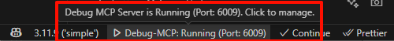
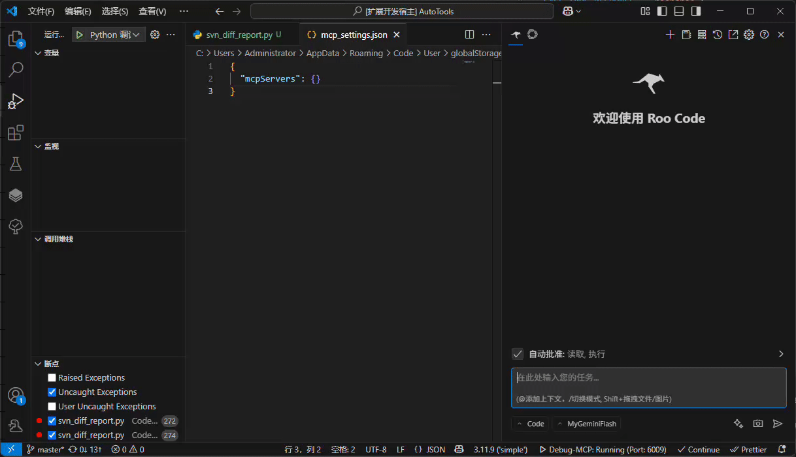
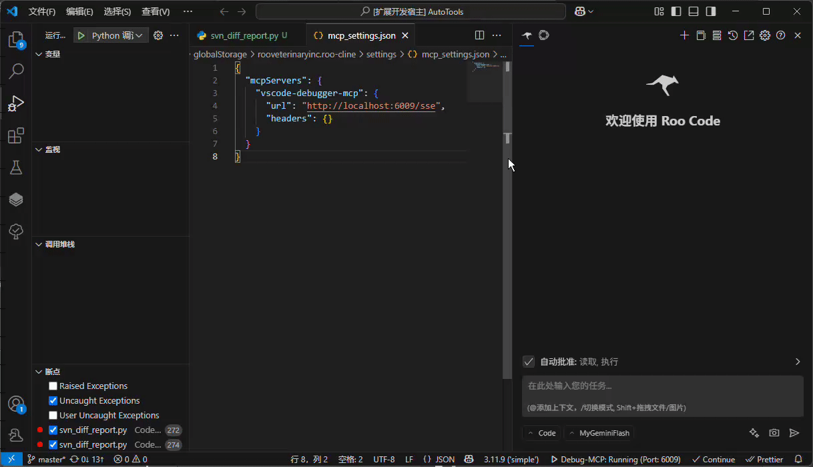
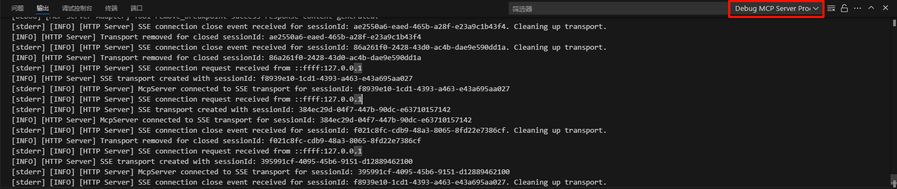
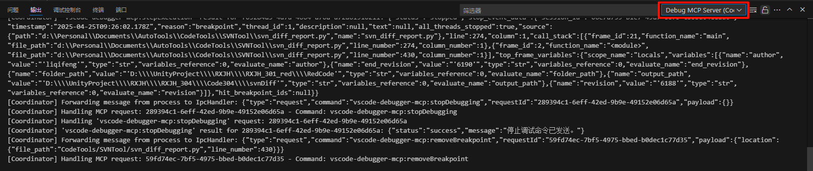

# VSCode Debugger MCP

这是一个 VS Code 扩展，旨在通过 Model Context Protocol (MCP) 服务器，使 AI 代理能够与 VS Code 的调试功能进行交互，从而实现自动化和智能化的调试体验。使用[RooCode](https://github.com/RooVetGit/Roo-Code) + [Gemini 2.5 Pro](https://deepmind.google/technologies/gemini/pro/) 辅助开发

## ✨ 特性

*   **🤖 AI 驱动的调试**:
    *   通过 MCP 工具接口，允许 AI 代理执行标准的 VS Code 调试操作。
    *   **调试配置**: 读取项目中的 `launch.json` 文件，获取可用的调试配置。
    *   **断点管理**: 设置、移除和查询断点，支持常规断点、条件断点、命中次数断点和日志点。
    *   **执行控制**: 启动调试会话（`launch` 或 `attach` 模式）、继续执行 (`Continue`)、单步执行（`Step Over`, `Step Into`, `Step Out`）以及停止调试会话。
    *   **(未来)** 检查变量值、遍历调用栈、在特定上下文中求值表达式等。
*   **⚙️ MCP 服务器管理**:
    *   **状态栏集成**: 在 VS Code 状态栏实时显示 MCP 服务器的运行状态（例如 "Debug-MCP: Running" 或 "Debug-MCP: Stopped"）。
    *   **便捷控制**: 点击状态栏项可快速启动或停止 MCP 服务器。
    *   **端口配置**: 自动检测端口占用。如果默认端口被占用，允许用户手动指定一个新的端口号，该设置会持久化保存。
    *   **自动启动**: 可配置是否在 VS Code 启动时自动启动 MCP 服务器。
    *   **客户端配置**: 提供一键复制功能，方便将连接此 MCP 服务器所需的配置信息（如 URL、端口）复制到 AI 客户端（如 ClaudeDesktop, RooCode, Cline, Cursor 等）。
*   **📡 通信协议**:
    *   VS Code 扩展与本地 MCP 服务器之间通过子进程和 IPC 通信。
    *   MCP 服务器与 AI 客户端之间使用 **HTTP + Server-Sent Events (SSE)** 进行通信，确保实时性和可靠性。

## 🚀 要求

*   **Visual Studio Code**: ^1.85.0 或更高版本。
*   **Node.js**: ^18.0.0 或更高版本 (用于运行 MCP 服务器)。
*   **如何安装 Node.js**: 请访问 [Node.js 官方网站](https://nodejs.org/) 下载并安装适合您操作系统的版本。
*   **AI客户端** 支持 Model Context Protocol 的 AI 代理客户端。

## 📖 使用指南
以RooCode为例
1. 在VsCode插件市场中搜索安装插件
2. 确认MCP服务器已开启 
3. 复制配置到RooCodeMCP配置文件中. 
4. 每次使用前,检查RooCode是否和MCP服务器连接. 

## 🔧 扩展设置

本扩展提供以下 VS Code 设置项 (`settings.json`):

*   `vscode-debugger-mcp.server.port` (number): MCP 服务器监听的端口号。默认为 `6009`。
*   `vscode-debugger-mcp.server.autoStart` (boolean): 是否在 VS Code 启动时自动启动 MCP 服务器。默认为 `true`。

## 🐞 已知问题/潜在问题

*   只在 RooCode 这一个客户端做过简单测试,尚不清楚在其他客户端工作情况

### 日志与报错信息
如果发现错误,可在VsCode的输出中查看日志,方便反馈提issues.
*   MCP服务器日志:
*   插件与模拟客户端日志:

## 🔮 未来开发计划

*   **变量与作用域检查**:
    *   实现 `get_scopes` 工具：获取指定堆栈帧的作用域（如局部变量、全局变量）。
    *   实现 `get_variables` 工具：获取指定作用域或可展开变量下的变量列表及其值。
*   **表达式求值**:
    *   实现 `evaluate_expression` 工具：在指定的堆栈帧上下文中计算表达式。
*   **国际化**
*   *   README图片和使用指南英文版
## 🎉 发布说明

### 1.0.0
*   实现 `stop_debugging` 工具。
*   实现 `step_execution` 工具 (Step Over, Step Into, Step Out)。
*   实现 `continue_debugging` 工具。
*   实现 `start_debugging` 工具。
*   实现 `remove_breakpoint` 工具。
*   实现 `get_breakpoints` 工具。
*   实现 `set_breakpoint` 工具。
*   实现 `get_debugger_configurations` 工具。
*   MCP 服务器通信方式为 HTTP + SSE。
*   增加端口冲突处理和手动指定端口功能。
*   增加自动启动 MCP 服务器的配置选项。
*   提供一键复制客户端配置的功能。
*   模拟客户端接收原始SSE返回信息

### 0.1.0
*   初始版本。
*   实现 VS Code 扩展基本结构。
*   在状态栏显示 MCP 服务器状态（模拟）。
*   实现简单的 MCP 服务器启停控制（通过状态栏）。

---

## 感谢以下优秀开源项目
[RooCode](https://github.com/RooVetGit/Roo-Code)
