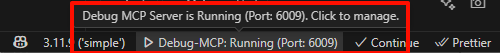
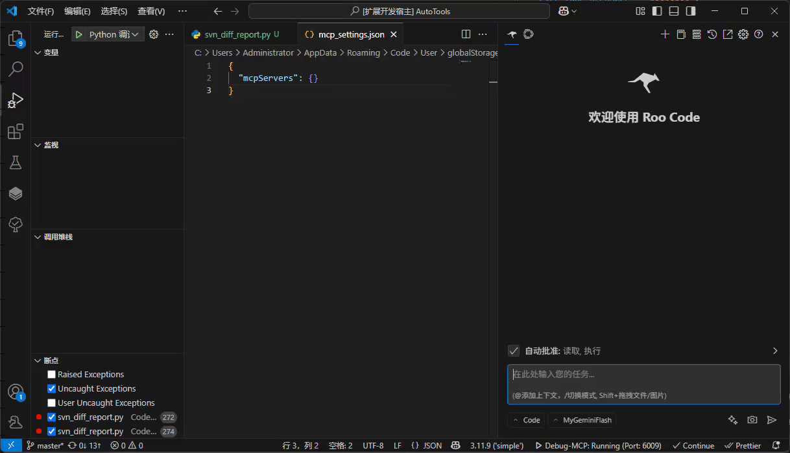
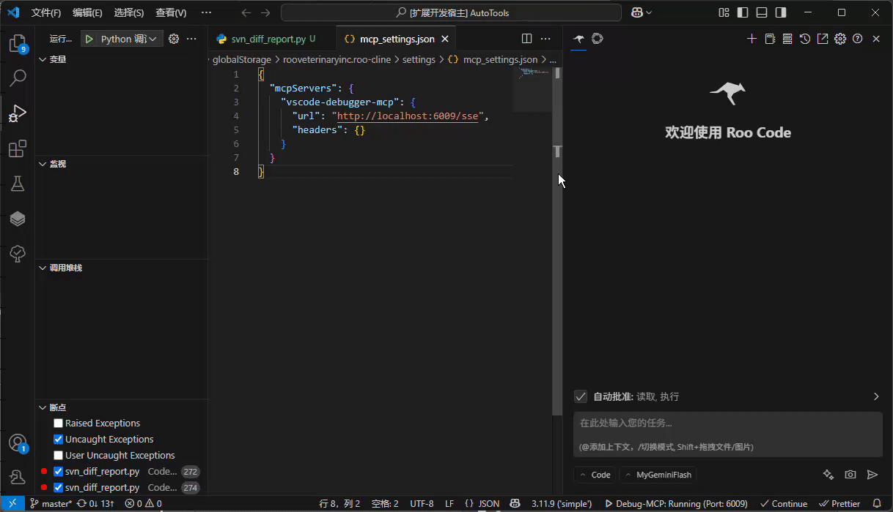
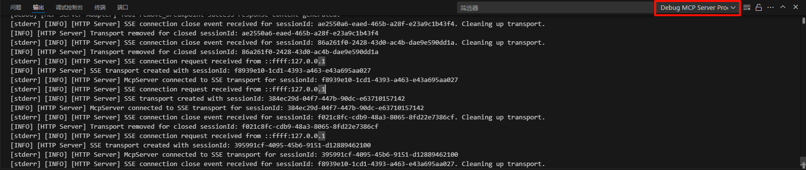
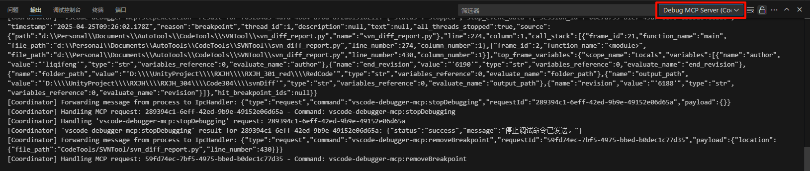

# VSCode Debugger MCP

This is a VS Code extension designed to enable AI agents to interact with VS Code's debugging capabilities through a Model Context Protocol (MCP) server, achieving an automated and intelligent debugging experience. Assisted development using [RooCode](https://github.com/RooVetGit/Roo-Code).

## ✨ Features

*   **🤖 AI-Driven Debugging**:
    *   Allows AI agents to perform standard VS Code debugging operations through the MCP tool interface.
    *   **Debug Configurations**: Reads the project's `launch.json` file to get available debug configurations.
    *   **Breakpoint Management**: Set, remove, and query breakpoints, supporting regular breakpoints, conditional breakpoints, hit count breakpoints, and log points.
    *   **Execution Control**: Start debugging sessions (`launch` or `attach` mode), continue execution (`Continue`), step through code (`Step Over`, `Step Into`, `Step Out`), and stop debugging sessions.
    *   **(Future)** Inspect variable values, traverse the call stack, evaluate expressions in specific contexts, etc.
*   **⚙️ MCP Server Management**:
    *   **Status Bar Integration**: Displays the real-time running status of the MCP server in the VS Code status bar (e.g., "Debug-MCP: Running" or "Debug-MCP: Stopped").
    *   **Convenient Control**: Click the status bar item to quickly start or stop the MCP server.
    *   **Port Configuration**: Automatically detects port occupancy. If the default port is occupied, allows the user to manually specify a new port number, which will be persistently saved.
    *   **Auto Start**: Configurable option to automatically start the MCP server when VS Code launches.
    *   **Client Configuration**: Provides a one-click copy function to easily copy the configuration information (such as URL, port) required to connect to this MCP server to AI clients (e.g., ClaudeDesktop, RooCode, Cline, Cursor, etc.).
*   **📡 Communication Protocol**:
    *   The VS Code extension communicates with the local MCP server via subprocess and IPC.
    *   The MCP server communicates with AI clients using **HTTP + Server-Sent Events (SSE)**, ensuring real-time and reliability.

## 🚀 Requirements

*   **Visual Studio Code**: ^1.85.0 or higher.
*   **Node.js**: ^18.0.0 or higher (for running the MCP server).
*   **How to Install Node.js**: Please visit the [Node.js official website](https://nodejs.org/) to download and install the version suitable for your operating system.
*   **AI Client**: An AI agent client that supports the Model Context Protocol.

## 📖 Usage Guide

Taking RooCode as an example:
1. Search and install the extension in the VS Code Extensions Marketplace.
Confirm that the MCP server is running. 
Copy the configuration to the RooCode MCP configuration file. 
Before each use, check if RooCode is connected to the MCP server. 

## 🔧 Extension Settings

This extension provides the following VS Code settings (`settings.json`):

*   `vscode-debugger-mcp.server.port` (number): The port number the MCP server listens on. Defaults to `6009`.
*   `vscode-debugger-mcp.server.autoStart` (boolean): Whether to automatically start the MCP server when VS Code launches. Defaults to `true`.

## 🐞 Known Issues / Potential Issues

*   Only simple tests have been done with the RooCode client. It is unclear how it works with other clients.

### Logs and Error Information

If you find errors, you can view the logs in the VS Code Output panel for easier feedback and issue reporting.
*   MCP Server Logs: 
*   Extension and Simulated Client Logs: 

## 🔮 Future Development Plan

*   **Variable and Scope Inspection**:
    *   Implement `get_scopes` tool: Get scopes (e.g., local variables, global variables) for a specified stack frame.
    *   Implement `get_variables` tool: Get a list of variables and their values for a specified scope or expandable variable.
*   **Expression Evaluation**:
    *   Implement `evaluate_expression` tool: Evaluate an expression in the context of a specified stack frame.
*   **Internationalization**
*   *   Translate tooltips to English.
*   *   English version of README images and usage guide.
## 🎉 Release Notes

### 1.0.0
*   Implemented `stop_debugging` tool.
*   Implemented `step_execution` tool (Step Over, Step Into, Step Out).
*   Implemented `continue_debugging` tool.
*   Implemented `start_debugging` tool.
*   Implemented `remove_breakpoint` tool.
*   Implemented `get_breakpoints` tool.
*   Implemented `set_breakpoint` tool.
*   Implemented `get_debugger_configurations` tool.
*   MCP server communication method is HTTP + SSE.
*   Added port conflict handling and manual port specification feature.
*   Added configuration option for automatic MCP server startup.
*   Provided one-click copy function for client configuration.
*   Simulated client receives raw SSE return information.

### 0.1.0
*   Initial version.
*   Implemented basic VS Code extension structure.
*   Displayed MCP server status in the status bar (simulated).
*   Implemented simple MCP server start/stop control (via status bar).

---

## Thanks to the following excellent open source projects
[RooCode](https://github.com/RooVetGit/Roo-Code)
